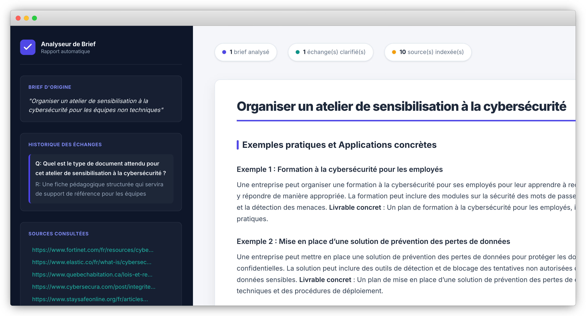

# Agent Brief — AI-Powered Brief Analyzer

<p align="center">
  
</p>

> A LangGraph-based AI agent that analyzes a brief, asks clarifying questions, runs a dynamic RAG pipeline, and generates a structured HTML dashboard.

Built by **Umberto Emonds**

---

## What it does

1. **Analyzes** the user's brief using an LLM
2. **Clarifies** missing information via human-in-the-loop interrupts
3. **Retrieves** relevant sources via Tavily + dynamic RAG (HuggingFace + Chroma)
4. **Generates** a complete pedagogical fiche in Markdown
5. **Exports** the result as a styled HTML dashboard

---

## Tech stack

| Component | Technology |
|---|---|---|
| Agent orchestration | LangGraph |
| LLM | Groq — `llama-3.3-70b-versatile` |
| Web search | Tavily |
| Embeddings | HuggingFace — `all-MiniLM-L6-v2` |
| Vector store | Chroma (ephemeral, per run) |
| Scraping | requests + BeautifulSoup |
| Web UI | Streamlit |
| Output | HTML + CSS dashboard |

---

## Setup

```bash
git clone https://github.com/your-username/agent-brief.git
cd agent-brief
python -m venv .venv
source .venv/bin/activate
pip install -r requirements.txt
```

Create a `.env` file at the root:

```env
GROQ_API_KEY=your_groq_api_key
TAVILY_API_KEY=your_tavily_api_key
```

---

## Usage

### CLI
```bash
python main.py
```

### Web UI (Streamlit)
```bash
streamlit run streamlit_app.py
```

---

## Project structure

```
agent-brief/
├── agentbrief/
│   ├── state.py         # BriefState and QA TypedDicts
│   ├── nodes.py         # Graph node functions + LLM prompts
│   ├── graph.py         # Graph construction and compilation
│   ├── routing.py       # Conditional edge routing
│   ├── rag.py           # Dynamic RAG pipeline
│   ├── config.py        # Configuration constants
│   ├── templates.py     # HTML template rendering
│   ├── templates/
│   │   └── dashboard.html
│   └── utils/
│       └── md_to_html.py
├── streamlit_app.py     # Streamlit web UI
├── main.py              # CLI entry point
├── assets/
│   └── demo.png
├── output/              # Generated dashboards (gitignored)
├── .env                 # API keys (gitignored)
├── .streamlit/
│   └── config.toml
├── AGENTS.md            # Agent conventions
└── requirements.txt
```

---

## Graph architecture

```
START → call_model → more (optional loop) → retrieve → generate → create_html → END
```

| Node | Role |
|---|---|
| `call_model` | Analyzes the brief, detects if clarification is needed |
| `more` | Asks a clarification question (human-in-the-loop) |
| `retrieve` | Web search + dynamic RAG pipeline |
| `generate` | Generates the fiche in Markdown |
| `create_html` | Exports as a styled HTML dashboard |

---